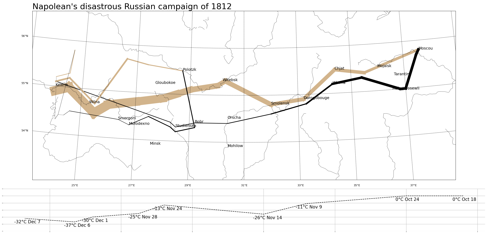

# Practice Project Two: Napoleon's Russian Campaign

## Introduction

This project, "Napoleon's Russian Campaign," recreates the renowned data visualization [Charles Minard's Napoleon's disastrous Russian campaign of 1812](https://en.wikipedia.org/wiki/Charles_Joseph_Minard#/media/File:Minard.png). We used `pandas` and `sqlite3` to build the database, and used `matplotlib` and `basemap` for proof of concept and to produce the finished product.

## How to Reproduce

- Install [Miniconda](https://docs.anaconda.com/miniconda)
- Build the environment based on `environment.yml`

```bash
conda env create -f environment.yml
```

- Place `minard.txt` from the `data/` folder into a `data/` folder in your working directory.
- Activate the environment and run `python create_minard_db.py` to create `minard.db` in the `data/` folder.
- Activate the environment and run `python plot_with_basemap.py` to generate `minard_clone.png`



## Key Takeaways
- Composing a multi-panel figure: Combined a geographic map and a temperature timeline in one figure using `gridspec`, with the map taking four times the vertical space. Aligning the temperature x-axis (longitude) with the map required coordinating two separate axes.
- Encoding data through line width and color simultaneously: Survival numbers map to line width (thinner = more deaths); direction of march maps to color (tan vs. black). This meant iterating segment by segment and scaling raw counts (`surviv / 10000`) into readable widths.
- Geographic projections and real-world coordinates: Using `basemap` with a Lambert Conformal Conic projection required converting lon/lat pairs into projected x/y before plotting — an introduction to the key concept that geographic data cannot be treated as plain Cartesian coordinates.
